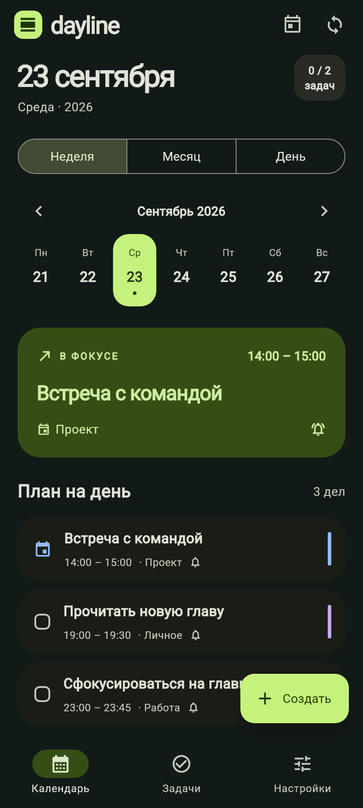

# Dayline

Календарь, задачи и напоминания для **Android и Windows** с двусторонним обменом через **Obsidian**.

Планируйте день на телефоне или компьютере, храните дела в обычном Markdown и следите за ближайшими событиями в виджете. Dayline работает с локальными файлами и не требует отдельного аккаунта.

<p align="center">
  
</p>

## Возможности

- **События и задачи:** время начала и окончания, дела на весь день, переход через полночь.
- **План дня:** календарь месяца, выбор дня недели, расписание, поиск и фильтры задач.
- **Повторы:** ежедневно, по будням, еженедельно и ежемесячно. Выполнение отмечается для отдельного вхождения.
- **Организация:** приоритеты, цвета, заметки и категории из папок Obsidian.
- **Напоминания:** уведомления перед началом дела с несколькими интервалами.
- **Obsidian:** чтение и запись `Dayline.md`, импорт правок и отметок о выполнении, сохранение обеих версий при конфликте.
- **Интерфейс:** русский язык, светлая и тёмная темы, адаптация к размеру окна.

### Android

Домашний виджет со списком ближайших дел, прокруткой и быстрым созданием записи. Напоминания используют системный планировщик Android и восстанавливаются после перезагрузки устройства.

### Windows

Календарь и план дня рядом в широком окне, создание записи по `Ctrl+N`, работа в системном трее.

Отдельный виджет рабочего стола показывает до 50 невыполненных задач и событий на ближайшие 30 дней. Его можно перемещать, менять размер и закреплять поверх окон. Двойной щелчок по записи открывает редактор; положение, размер и видимость сохраняются.

## Поддерживаемые платформы

| Платформа | Требования |
| --- | --- |
| Android | Android 12 и новее, ARM64; проверено на Google Pixel 9 |
| Windows | Windows 10 / 11, x64 |

## Быстрый старт

1. Установите Android APK или распакуйте Windows-архив целиком и запустите `Dayline.exe`.
2. Откройте **Настройки → Подключить папку** и выберите корень хранилища Obsidian.
3. Создайте задачу или событие. Запись появится в календаре и в файле `Dayline.md`.
4. На Android добавьте виджет через меню виджетов главного экрана. На Windows используйте **Настройки → Виджет на рабочем столе**.
5. Разрешите уведомления; на Android для точного времени также предоставьте доступ к будильникам и напоминаниям.

В репозитории размещены исходники обеих версий. Инструкции для самостоятельной сборки — ниже.

## Как работает Obsidian

Dayline читает и записывает один файл `Dayline.md` в выбранной папке. Категории берутся из папок и вложенных папок хранилища, кроме служебных каталогов с точкой в начале имени. Выбор категории не переносит запись в другой файл.

На телефоне и компьютере выберите соответствующие локальные копии одного хранилища. Передачу файлов между устройствами обеспечивает настроенная вами синхронизация Obsidian: Dayline не подключается к аккаунту Obsidian и не переносит хранилище самостоятельно.

Можно добавлять дела прямо в Markdown:

```markdown
- [ ] Подготовить план 📅 2026-10-02 10:00–11:00
- [ ] Купить материалы 📅 2026-10-03
```

Дата обязательна. Без времени запись считается задачей на весь день. Новые строки, добавленные в Obsidian, импортируются без напоминания — его можно включить в редакторе.

Названия, даты, время, приоритет и флажки выполнения можно менять в Obsidian. Сохраняйте комментарии `<!-- dayline:… -->`: в них находятся идентификаторы, категории, повторы и другие свойства записи. В режиме чтения Obsidian эти комментарии скрыты.

Синхронизация выполняется после сохранения, при открытии приложения и каждые 30 секунд, пока оно работает. В Windows обновления продолжаются в трее. На Android после внешней правки хранилища откройте Dayline, чтобы обновить календарь, виджет и напоминания.

## Виджеты и фоновая работа

| | Android | Windows |
| --- | --- | --- |
| Размещение | Главный экран | Отдельное окно рабочего стола |
| Список | До 60 записей | До 50 записей за 30 дней |
| Открытие дела | Нажатие | Двойной щелчок или Enter |
| Быстрое создание | Кнопка в виджете | Кнопка «Создать» |
| Работа без главного окна | Системный виджет и напоминания | Пока приложение работает в трее |

На Windows крестик главного окна сворачивает Dayline в трей. Полный выход находится в настройках и меню трея; после него виджет, синхронизация и напоминания останавливаются. Автозапуск не включается автоматически. Windows может скрывать уведомления при включённой фокусировке внимания.

На Android принудительная остановка в системных настройках приостанавливает напоминания до следующего запуска приложения.

## Сборка из исходников

Проверенная среда: **Flutter 3.44.8**, **Dart 3.12.2**. Для Android нужны JDK 21 и Android SDK 36, для Windows — Visual Studio 2022 с компонентами **Desktop development with C++** и Windows SDK.

```sh
git clone https://github.com/PaladinAlexandr/dayline.git
cd dayline
flutter pub get
flutter analyze
flutter test
```

### Android

Для локальной отладки:

```sh
flutter run
```

Для подписанной release-сборки создайте свой ключ:

```sh
keytool -genkeypair -v -keystore android/upload-keystore.jks -keyalg RSA -keysize 2048 -validity 10000 -alias upload
```

Скопируйте `android/key.properties.example` в `android/key.properties` и укажите пароли и путь к ключу. Эти файлы исключены из Git.

```sh
flutter build apk --release --target-platform android-arm64
```

APK появится в `build/app/outputs/flutter-apk/`. Без `key.properties` release не подписывается вашим ключом; для установки используйте настроенную подпись. Чтобы обновить уже установленное приложение без удаления его данных, нужны тот же ключ подписи и больший номер сборки.

### Windows

Сборка выполняется на Windows:

```sh
flutter build windows --release
```

Результат: `build/windows/x64/runner/Release/`. Распространяйте всю папку вместе с DLL и `data`, а не один EXE. На целевом компьютере необходим Visual C++ Runtime x64.

## Структура проекта

```text
lib/                 Интерфейс, календарь, Markdown и синхронизация
android/             Android-приложение, домашний виджет и напоминания
windows/             Окно, трей, уведомления и виджет рабочего стола
test/                Модель данных, обмен файлами и проверки интерфейса
docs/                Документация и изображения
```

Общая логика написана на Dart. Android-интеграция использует Kotlin, Windows-интеграция — C++ и Win32 API.

## Данные и ограничения

- Задачи из других заметок хранилища автоматически не импортируются. Обмен ограничен `Dayline.md`.
- Формат повторов Dayline не использует генерацию записей плагином Obsidian Tasks.
- Максимальный размер `Dayline.md` — 2 МБ. Подзадачи, Kanban и разбор естественного языка не поддерживаются.
- При несовместимых одновременных изменениях сохраняются обе версии записи. Если общий файл исчез, синхронизация останавливается, сохраняя локальные дела.
- На Windows локальные данные находятся в `%LOCALAPPDATA%\Dayline`. Перед ручным восстановлением файлов полностью завершите приложение.
- Windows-сборка распространяется без установщика и сертификата издателя.

## Обратная связь

Ошибки и предложения можно отправить через [Issues](https://github.com/PaladinAlexandr/dayline/issues). Укажите платформу, версию приложения и шаги воспроизведения. Для примеров используйте тестовые записи без личных данных.
